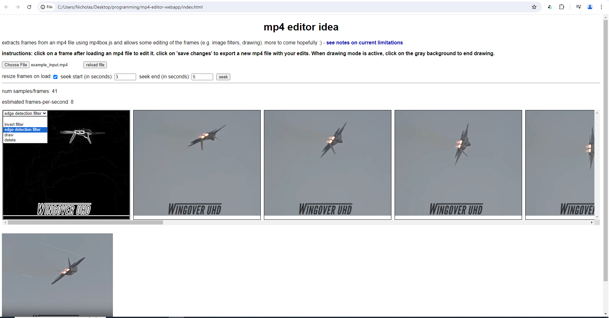

# mp4 editor idea    
    
exploring the WebCodecs API with mp4 files :D. right now it can only extract frames and some very basic editing (a couple image filters, ability to delete frames). you can also seek to a certain time range and gather frames from that range.    
    
this app is currently likely most useful for only small mp4 files (e.g. with durations of a few seconds to maybe a couple minutes).   
    
    
    
## acknowledgements:
much thanks to the contributors to [mp4box.js](https://github.com/gpac/mp4box.js), the WebCodecs demos/API and [josephrocca](https://github.com/josephrocca/getVideoFrames.js/tree/main?tab=readme-ov-file).    
    
the F-22 Raptor demo used for the `example_input.mp4` file came from [Wingover UHD](https://www.youtube.com/watch?v=nwPMj3eceAs)